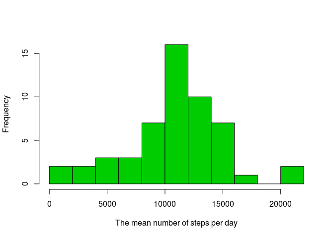
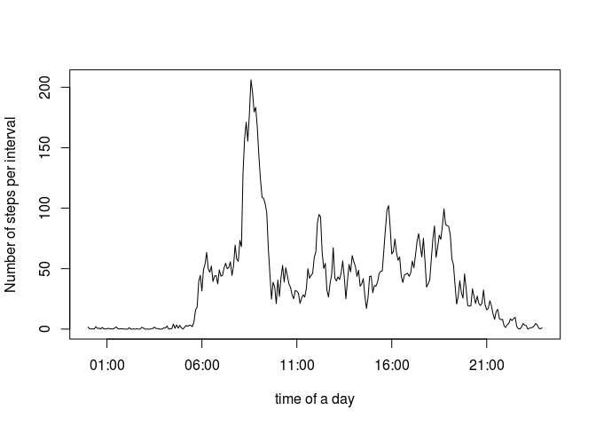
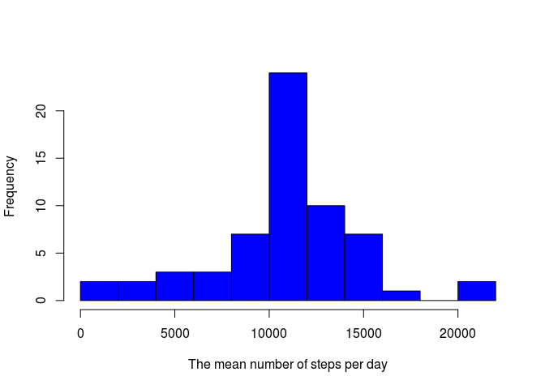
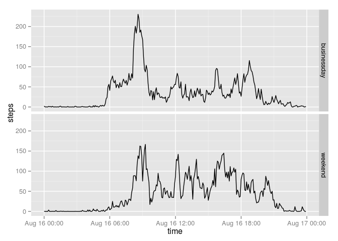

# Reproducible Research: Peer Assessment 1

**Maiia Bakhova**

## Loading and preprocessing the data

The data should be in a directory, which is used for git files. Since this is individual I moved it to my working 
directory and started from here. Downloading the data: 


```r
pr1 <- read.csv("activity.csv")
```
Let us check what kind of data we have.

```r
str(pr1)
```

```
## 'data.frame':	17568 obs. of  3 variables:
##  $ steps   : int  NA NA NA NA NA NA NA NA NA NA ...
##  $ date    : Factor w/ 61 levels "2012-10-01","2012-10-02",..: 1 1 1 1 1 1 1 1 1 1 ...
##  $ interval: int  0 5 10 15 20 25 30 35 40 45 ...
```
Now we see that first column represents steps and  has some missing values. Second column represents a date in a character form. 
Third column looks like integers, but it is marked as intervals. I need a closer look.

```r
unique(pr1$interval)
```

```
##   [1]    0    5   10   15   20   25   30   35   40   45   50   55  100  105
##  [15]  110  115  120  125  130  135  140  145  150  155  200  205  210  215
##  [29]  220  225  230  235  240  245  250  255  300  305  310  315  320  325
##  [43]  330  335  340  345  350  355  400  405  410  415  420  425  430  435
##  [57]  440  445  450  455  500  505  510  515  520  525  530  535  540  545
##  [71]  550  555  600  605  610  615  620  625  630  635  640  645  650  655
##  [85]  700  705  710  715  720  725  730  735  740  745  750  755  800  805
##  [99]  810  815  820  825  830  835  840  845  850  855  900  905  910  915
## [113]  920  925  930  935  940  945  950  955 1000 1005 1010 1015 1020 1025
## [127] 1030 1035 1040 1045 1050 1055 1100 1105 1110 1115 1120 1125 1130 1135
## [141] 1140 1145 1150 1155 1200 1205 1210 1215 1220 1225 1230 1235 1240 1245
## [155] 1250 1255 1300 1305 1310 1315 1320 1325 1330 1335 1340 1345 1350 1355
## [169] 1400 1405 1410 1415 1420 1425 1430 1435 1440 1445 1450 1455 1500 1505
## [183] 1510 1515 1520 1525 1530 1535 1540 1545 1550 1555 1600 1605 1610 1615
## [197] 1620 1625 1630 1635 1640 1645 1650 1655 1700 1705 1710 1715 1720 1725
## [211] 1730 1735 1740 1745 1750 1755 1800 1805 1810 1815 1820 1825 1830 1835
## [225] 1840 1845 1850 1855 1900 1905 1910 1915 1920 1925 1930 1935 1940 1945
## [239] 1950 1955 2000 2005 2010 2015 2020 2025 2030 2035 2040 2045 2050 2055
## [253] 2100 2105 2110 2115 2120 2125 2130 2135 2140 2145 2150 2155 2200 2205
## [267] 2210 2215 2220 2225 2230 2235 2240 2245 2250 2255 2300 2305 2310 2315
## [281] 2320 2325 2330 2335 2340 2345 2350 2355
```
As we see, there at most 4 digits, and the last 2 stand for minutes (they run from 0 to 55), while the first two (if present) must be hours. 

## What is mean total number of steps taken per day?
To find the value we need at first to compute the total number of steps taken daily. I will assign the value to variable "totalPerDay". In the assignment description there was a question about a histogram, so it goes next, too.


```r
totalPerDay <-  tapply(pr1$steps,  pr1$date, sum)
hist(totalPerDay, breaks=10, col=3, 
     xlab="The mean number of steps per day", 
     main=NULL)
```


The average number of steps per day is (skipping missed values):

```r
mean(totalPerDay, na.rm=T)
```

```
## [1] 10766.19
```
  In the assignment description there was a question about median as well.

```r
median(totalPerDay, na.rm=T)
```

```
## [1] 10765
```


## What is the average daily activity pattern?

  We remember that our intervals are not represented as time values. It means that we need to convert them. At first I put them in separate vector and change their class to "character".
Then we need to "fatten up" the given numbers with zeros. I will create a function "fixIn" for this. The vector "tive" will be the interval column converted into conventional time format.


```r
tve <-  as.character(unique(pr1$interval))
 fixIn <-function(x){
    k<-nchar(x)
    if (k < 4) {
    z=paste(rep("0",4-k),sep = "", collapse = "")
    x=paste(z, x, sep = "", collapse = "")
    }  else {
     x=x
     }
 }
tive = sapply(tve, fixIn)
names(tive)=NULL
tive = strptime (tive,  format="%H%M")
```
(To you, my peer grader: if you know simpler way to do it, please tell.)

  Then I will create a vector of average numbers of steps and a plot of the average daily activity pattern.


```r
avPerInt = tapply(pr1$steps, pr1$interval, mean, na.rm=T)
plot(tive, avPerInt, type = "l", 
     xlab="time of a day", ylab="Number of steps per interval")
```

 
And the maximum is reached at 8:45 (which is 104th entry of the vector), as it is shown below.

```r
which.max(avPerInt)
```

```
## 835 
## 104
```

## Imputing missing values

At first we need to figure out missing values. Since I will need their positions later I will create a vector to mark their places. We cab compute how many of them are in the date.


```r
NAval=is.na(pr1$steps)
sum(NAval)
```

```
## [1] 2304
```
Then I will need some values to replace the missing ones.For each missing interval value I've chosen to use the mean value for this 5-minute interval in the data. Calculating:


```r
avPerInt = tapply(pr1$steps, pr1$interval, mean, na.rm=T)
```
And replacing:


```r
Steps = pr1$steps
Steps[NAval] <- avPerInt
library(dplyr)
pr1n=mutate(pr1, steps=Steps)
```
The data set "pr1n" is the same as original, but with the missed data filled in. Now computing updated total values yields:


```r
totalPerDay <-  tapply(pr1n$steps,  pr1n$date, sum)
```
And the new histogram without missing values is:


```r
totalPerDay <-  tapply(pr1n$steps,  pr1n$date, sum)
hist(totalPerDay, breaks=10, col=4, 
     xlab="The mean number of steps per day", 
     main=NULL)
```

 
Now the average number of steps per day is (skipping missed values):


```r
mean(totalPerDay)
```

```
## [1] 10766.19
```
The mean did not change, since I've used mean values for each interval. The medians in the first case and in the second are different.

## Are there differences in activity patterns between weekdays and weekends?

At first we need to form a vector to distinguish the data between weekdays and weekends.


```r
weekD= weekdays(strptime(pr1$date,  format="%Y-%m-%d"))
wkEnd=(weekD=="Saturday" | weekD=="Sunday")
```
I can make the required vector as well, but my solution does not need it.


```r
NewFactorVariable=factor(ifelse(wkEnd, "weekend","weekday"))
```
Next step is partition the data:


```r
pr1WE=pr1n[wkEnd,]
pr1WD=pr1n[!wkEnd,]
```
Here are averagings across the intervals:


```r
avPerIntwe = tapply(pr1WE$steps, pr1WE$interval, mean)
avPerIntwd = tapply(pr1WD$steps, pr1WD$interval, mean)
```
Now I need to form a data frame for the last panel plot.


```r
busidays=data.frame(time=tive, steps=avPerIntwd, weekday="businessday" )
weekends=data.frame(time=tive, steps=avPerIntwe, weekday="weekend" )
lastDF=bind_rows(busidays,weekends)
```

```
## Warning in rbind_all(list(x, ...)): Unequal factor levels: coercing to
## character
```
And here is the panel plot:


```r
library(ggplot2)
qplot(time, steps, data=lastDF, facets=weekday~., geom="line")
```

 

As we see in both cases there is almost no movement between 24:00 and 5:00, and there is a notable surge in activity between 8:00 and 9:30. But most of the time the activity patterns are different for weekends and business days: on average during a business day moving activity is more structured, with clear increases at waking up, getting to work, lunch time, going home and dinner time. (As you see, I could not remove the particular date. My computer assumed that it should be the day at which I've edited the file. Any advice on it will be appreciated, too.)

